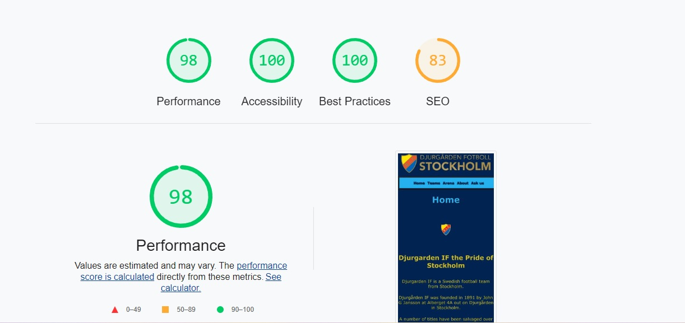
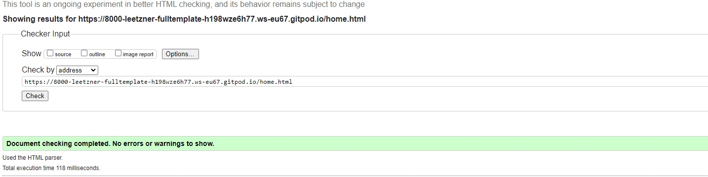
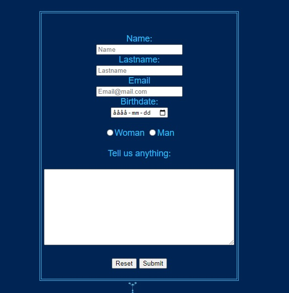

CONTENTS OF THIS FILE
---------------------

 * Introduction
 * Built with
 * Pictures
 * Bugs
 * Usage
 * Contact
 * Note to self
 * Acknowlagement

# Introduction

This project is my first creation, it´s a fan-website for the Swedish football team Djurgårdens IF. 
I wanted a challenge creating this website so I started coding without help from the course-material. 
The reason behind this is that´s the way I learn things, by doing, and I am here to learn. 
 
This is my first project 
https://8000-leetzner-fulltemplate-h198wze6h77.ws-eu70.gitpod.io

# Built with

I´ve used:

* Visual Studio Code
* MS.Paint
* HTML
* CSS

# Pictures 
 

### This is the navigation header. 
### The diffrent buttons will make you navigate the page easily, the website is a 2 page site. 
### The first 4 buttons will scroll you on a single page and the "Ask us" button will navigate you to a form-page. 

### Media Querys

### I´ve Scored this on the "Lighthouse" tool 
 
### I´ve used this picture to create a nice looking footer, I´ve placed it ontop of a rectangular footer in same color to make it blend smoothly. 
 
### HTML Valid 
 
### CSS Valid 
 
### Created a Form section to play with in the future 

# Bugs

### I´ve encounter some bugs, used the Google inspect tool to solve them.
#### The textcontent in my lists weren´t centered. 
I learned the hard way that the browser sometimes add a style to text and other things to make it look "better". 
This was solved by inspecting the element with the google tool, added the "padding-inline-start: 0%;" to my lists to solve the bug. 
 

#### My website got squished. 
When i made my browserwindow smaller the pictures got squished. 
This was solved by using "%" instead of "px" to decide the width och the pictures and lists. 
 
Had a real struggle with this, had the wrong display function on 80% of my CSS, changed from "display-block" to "display-flex". 
That pretty much solved my case
#### Media querys. 
Didn´t get the hang on it at first, but with alot of googling and looking at forums I am happy with the layout now.

# Contact

Link to my GitHub page: https://github.com/Leetzner

# Note to self
Remember to plan the website carefully next time!

# Links

* http://www.dif.se
* http://www.google.com (for pictures)
